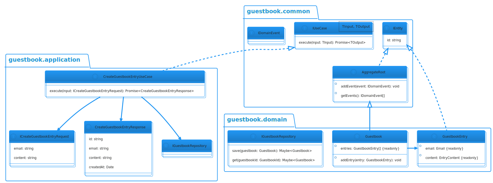

Quick and dirty demo for work

# Use Cases

## Create Guestbook Entry

### Data:

- Email

- Content

### Primary Course

1. User orders create " Guestbook entry" command with above data

2. System validates input

3. System creates guestbook entry

4. System delivers created guestbook entry

### Exception Course:

**Validation Error**:

1. System delivers error message to user

**Already placed an entry**:

1. System lets the user know that they are not allowed to create more than one entry

---

## Get Guestbook Entries

### Data

None

### Primary Course

1. User queries guestbook entries

2. System gets entries for guestbook

3. System delivers guestbook with entries
